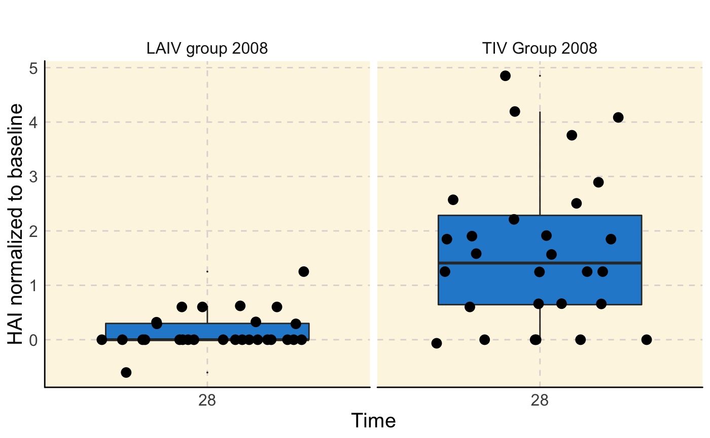

<!-- README.md is generated from README.Rmd. Please edit that file -->

# ImmuneSpaceR 

[](https://travis-ci.org/RGLab/ImmuneSpaceR)
[](https://codecov.io/gh/RGLab/ImmuneSpaceR/branch/master)
[](https://bioconductor.org/packages/stats/bioc/ImmuneSpaceR/)
[](http://bioconductor.org/packages/release/bioc/html/ImmuneSpaceR.html)

A thin wrapper around Rlabkey to access the
[ImmuneSpace](%22https://www.immunespace.org%22) database from R.

This package simplifies access to the
[HIPC](https://www.immuneprofiling.org/) ImmuneSpace database for R
programmers. It takes advantage of the standardization of the database
to hide all the
[`Rlabkey`](https://cran.r-project.org/web/packages/Rlabkey/index.html)
specific code away from the user. The study-specific datasets can be
accessed via an object-oriented paradigm.

## Installation

Install from
[Bioconductor](http://bioconductor.org/packages/release/bioc/html/ImmuneSpaceR.html):

``` r
source("https://bioconductor.org/biocLite.R")
biocLite("ImmuneSpaceR")
```

Or install the latest development version via
[`devtools`](https://cran.r-project.org/web/packages/devtools/index.html):

``` r
devtools::install_github("RGLab/ImmuneSpaceR")
```

The database is accessed with the user’s credentials. A `.netrc` file
storing login and password information is required.

Create netrc file in the computer running R:

  - On a **UNIX** system, this file should be named `.netrc`
  - On **Windows**, it sould be named `_netrc`
  - The file should be located in the user’s **home** directory
  - To determine home directory, run `Sys.getenv("HOME")` in R
  - The permissions on this file should be unreadable for everybody
    except the owner

The following three lines must be included in the `.netrc` or `_netrc`
file either separated by white space (spaces, tabs, or newlines) or
commas.

    machine www.immunespace.org
    login myUser@mySite.com
    password superSecretPassword

Multiple such blocks can exist in one file. Please ensure that the
machine name in the netrc file contains the “www” prefix as that is how
the package connects to immunespace by default. A mismatch will lead to
connection failures.

See [the official
documentation](https://www.labkey.org/Documentation/wiki-page.view?name=netrc)
from LabKey and the introductory vignette for an ImmuneSpace specific
setup.

## Usage

### Create a connection

The general idea is that the user creates an instance of an
`ImmuneSpaceConnection` class. The instance configures itself to connect
to a specific study, and datasets and gene expression matrices can be
retrieved by name.

For example:

``` r
library(ImmuneSpaceR)
study <- CreateConnection("SDY269")
```

will create an instance of SDY269.

### List datasets

Datasets can be listed by:

``` r
study$listDatasets()
#> datasets
#>  demographics
#>  elispot
#>  hai
#>  fcs_analyzed_result
#>  cohort_membership
#>  pcr
#>  elisa
#>  gene_expression_files
#>  fcs_sample_files
#> Expression Matrices
#>  SDY269_PBMC_TIV_Geo
#>  SDY269_PBMC_LAIV_Geo
```

which will print names of available datasets and gene expression
matrices.

### Retrieve datasets

Gene expression matrices or datasets can be retreived by:

``` r
LAIV2008 <- study$getGEMatrix("SDY269_PBMC_LAIV_Geo")
#> Downloading matrix..
#> Constructing ExpressionSet
elisa <- study$getDataset("elisa")
```

The study object *caches* data, so once it is retrieved, the next time
you access it, it will use the local cached copy. The package uses a
[R6](https://cran.r-project.org/web/packages/R6/index.html) class system
to represent the connection to a study and get around some of R’s
copy-on-change behaviour.

### Visualize

The `plot` method uses
[`ggplot2`](https://cran.r-project.org/web/packages/ggplot2/index.html)
functions to generate visualizations of datasets, leveraging the
standardized dataset tables.

``` r
study$plot("hai")
```



## Examples & Documentation

For more advanced examples and detailed documentation, see the package
vignettes and the reports available on
[ImmuneSpace](https://www.immunespace.org/).

## Contributing

If you’d like to report bugs/issues/feature requests or contribute to
the package, please see [the contributing guidelines](./CONTRIBUTING.md)
and join [our Slack workspace](https://immunespace.herokuapp.com/).
