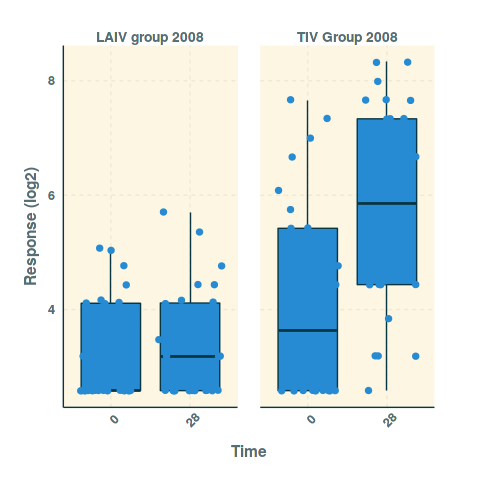

ImmuneSpaceR
============

A thin wrapper around Rlabkey to access the ImmuneSpace database from R
This package simplifies access to the HIPC ImmuneSpace database, for R programmers.

It takes advantage of the standardization of the ImmuneSpace database to hide all the `Rlabkey` specific code away from the user.
Study-specific datasets can be accessed via an object-oriented paradigm.

## Requirements
You may need to install RLabkey from our github repository (linked below). It has some additional error checking not present in the standard version. 


## Installation
The package requires a new version of `Rlabkey` available [here](https://github.com/RGLab/Rlabkey).

The package can be downloaded here and installed like any other R packages or installed directly from github using devtools.

```R
    library(devtools)
    install_github("RGLab/Rlabkey")
    install_github("RGLab/ImmuneSpaceR")
```

The database is accessed with the user's credentials. A `.netrc` file storing login and password information is required.

Create netrc file in the computer running R.

* On a UNIX system this file should be named `.netrc` (**dot** `netrc`) 
* On windows it sould be named `_netrc` (**underscore** `netrc`). 
* The file should be located in the users home directory and the permissions
on the file should be unreadable for everybody except the owner.To determine
home directory, run `Sys.getenv("HOME")` in R.

The following three lines must be included in the .netrc or _netrc file either
separated by white space (spaces, tabs, or newlines) or commas.

 machine `remote-machine-name` <br/>
 login `user-email`<br/>
 password `user-password`<br/>

Multiple such blocks can exist in one file.

Please ensure that your machine name in the netrc file contains the "www" prefix as that is how the package connects to immunespace by default. A mismatch will lead to connection failures. 

See `man netrc` for the official documentation.

## Usage
The general idea is that the user creates an instance of an `ImmuneSpaceConnection` class. 
The instance configures itself to connect to a specific study, and datasets and gene expression matrices can be retrieved by name.

For example:

```R
study <- CreateConnection("SDY269")
```

will create an instance of study 269.  The user needs credentials stored in a `.netrc` file to access the database. 
Datasets can be listed by:

```R
study$listDatasets()
```

which will print names of available datasets and gene expression matrices.

Gene expression matrices or data sets can be retreived by:

```R
study$getGEMarix("name")
# or
study$getDataset("name")
```

The study object *caches* data, so once it is retrieved, the next time you access it, it will use the local cached copy. 

The package uses a simple S5 reference class to represent the connection to a study and get around some of R's copy-on-change behaviour.

## Quick plots

The `quick_plot` function uses ggplot2's qplot function to generate quick plots of data sets, leveraging the standardized data set tables. 

```R
study$quick_plot("hai")
```



