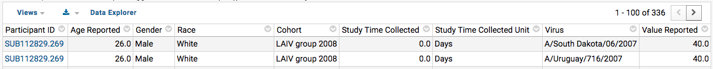

```{r knitr, echo = FALSE}
library(knitr)
opts_chunk$set(echo = TRUE)
```

```{r netrc_req, echo = FALSE}
# This chunk is only useful for BioConductor checks and shouldn't affect any other setup
if (!any(file.exists("~/.netrc", "~/_netrc"))) {
    labkey.netrc.file <- ImmuneSpaceR:::.get_env_netrc()
    labkey.url.base <- ImmuneSpaceR:::.get_env_url()
}
```

This vignette shows detailed examples for all functionalities of the `getDataset`
method.


# Create connections

As explained into the introductory vignette, datasets must be downloaded from `ImmuneSpaceConnection` objects. We must first instantiate a connection to the study or studies of interest. Throughout this vignette, we will use two connections, one to a single study, and one to to all available data.

```{r CreateConection, cache=FALSE, message=FALSE}
library(ImmuneSpaceR)
sdy269 <- CreateConnection("SDY269")
all <- CreateConnection("")
```


# List the datasets

Now that the connections have been instantiated, we can start downloading from themm but we need to figure out which datasets are available within our chosen studies. Printing the connections will, among other information, list the datasets availables. The `listDatasets` method will display only the information we are looking for.

```{r listDatasets}
sdy269$listDatasets()
all$listDatasets()
```

Naturally, `all` contains every dataset available on ImmuneSpace as it combines all available studies. Additionaly, when creating connection object with `verbose = TRUE`, a call to the `getDataset` method with an invalid dataset name will return the list of valid datasets.


# Download

Calling `getDataset` returns a selected dataset as it is displayed on ImmuneSpace. 

```{r getDataset}
hai_269 <- sdy269$getDataset("hai")
hai_all <- all$getDataset("hai")

head(hai_269)
```

Because some datasets such as flow cytometry results can contain a large number of rows, the method returns `data.table` objects to improve performance. This is especially important with multi-study connections.


# Filters

The datasets can be filtered before download. Filters should be created using `Rlabkey`'s `makeFilter` function.

Each filter is composed of three part:
* A column name or column label
* An operator
* A value or array of values separated by a semi-colon
 
```{r makeFilters, cache = FALSE}
library(Rlabkey)

# Get participants under age of 30
young_filter <- makeFilter(c("age_reported", "LESS_THAN", 30))

# Get a specific list of two participants
pid_filter <- makeFilter(c("participantid", "IN", "SUB112841.269;SUB112834.269"))
```

For a list of available operators, see `?Rlabkey::makeFilter`.

```{r filters}
# HAI data for participants of study SDY269 under age of 30
hai_young <- sdy269$getDataset("hai", colFilter = young_filter)

# List of participants under age 30
demo_young <- all$getDataset("demographics", colFilter = young_filter)

# ELISPOT assay results for two participants
mbaa_pid2 <- all$getDataset("elispot", colFilter = pid_filter)
```

Note that filtering is done before download. When performance is a concern, it is faster to do the filtering via the `colfFilter` argument than on the returned table.


# Views

Any dataset grid on ImmuneSpace offers the possibility to switch views between 'Default' and 'Full'. The Default view contains information that is directly relevant to the user. Sample description and results are joined with basic demographic. However, this is not the way data is organized in the database. The 'Full' view is a representation of the data as it is stored on [ImmPort](http://www.immport.org/immport-open/public/home/home). The accession columns are used under the hood for join operations. They will be useful to developers and user writing reports to be displayed in ImmuneSpace studies.


{width=675px}

Screen capture of the button bar of a dataset grid on ImmuneSpace.

The `original_view` argument decides which view is downloaded. If set to `TRUE`, the 'Full' view is returned.

```{r views}
full_hai <- sdy269$getDataset("hai", original_view = TRUE)

colnames(full_hai)
```

For additional information, refer to the ['Working with tabular data'](https://www.youtube.com/watch?v=69k8DquDK7o) video tutorial.


# Caching

As explained in the introductory guide, the `ImmuneSpaceConnection` class is a [`R6`](https://cran.r-project.org/web/packages/R6/index.html) class. It means its objects have fields accessed by reference. As a consequence, they can be modified without making a copy of the entire object. ImmuneSpaceR uses this feature to store downloaded datasets and expression  matrices. Subsequent calls to `getDataset` with the same input will be faster.

See `?R6::R6Class` for more information about R6 class system.

We can see the data currently cached using the `cache` field. This is not intended to be used for data manipulation and only displayed here to explain what gets cached.

```{r caching-dataset}
pcr <- sdy269$getDataset("pcr")
names(sdy269$cache)
```

Different views are saved separately.

```{r caching-views}
pcr_ori <- sdy269$getDataset("pcr", original_view = TRUE)
names(sdy269$cache)
```

Because of the infinite number of filters and combinations of filters, we do not cache filtered datasets.

If, for any reason, a specific dataset needs to be redownloaded, the `reload` argument will clear the cache for that specific `getDataset` call and download the table again.

```{r caching-reload}
hai_269 <- sdy269$getDataset("hai", reload = TRUE)
```

Finally, it is possible to clear every cached dataset (and expression matrix).

```{r caching-clear}
sdy269$clearCache()
names(sdy269$cache)
```

Again, the `cache` field should never be modified manually. When in doubt, simply reload the dataset.


# Session info

```{r sessionInfo}
sessionInfo()
```
