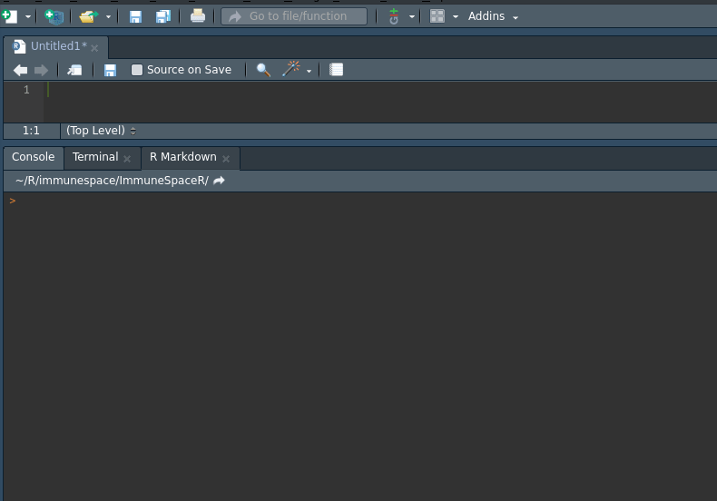
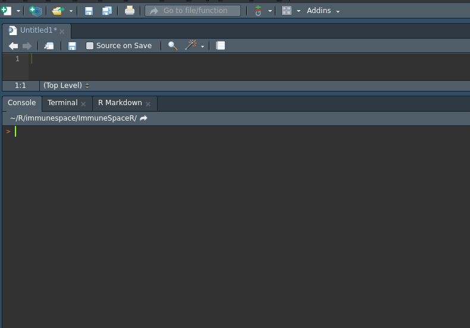

```{r knitr, echo=FALSE, cache = FALSE}
suppressWarnings(library(knitr))
library(rmarkdown)
opts_chunk$set(echo = TRUE)
```


This vignette shows detailed examples for all functionalities of the `interactive_netrc()` function.


# Configuration

In order to connect to ImmuneSpace, you will need a `.netrc` file in your home directory that will contain a `machine` name (hostname of ImmuneSpace), and your ImmuneSpace `login` and `password`. See [here](https://www.labkey.org/wiki/home/Documentation/page.view?name=netrc) for more information.

A netrc file may look like this:

```
machine datatools.immunespace.org
login myuser@domain.com
password supersecretpassword
```


# Writing your netrc file

There are two options when it comes to writing a netrc:

* If you're familiar with the command-line interface, see [the introductory vignette](https://rglab.github.io/ImmuneSpaceR/articles/Intro_to_ImmuneSpaceR.html).
* For those less comfortable with the command line, there is the `interactive_netrc` function.

## interactive_netrc()

The `interactive_netrc` function will:

* check if a netrc file already exists
* prompt the user for login and password information in the R console
* check that the provided login information allows the user to connect to ImmuneSpace
* if the connection is valid, then write the information to a netrc file in the user's home directory

Below is a gif demonstrating how to use this function:

{width=675px}

In the case that the user did not provide login information that results in a connection to ImmuneSpace, a netrc file will not be written to the user's home directory, and the user can try the method again checking for typos.

If the user still cannot connect to ImmuneSpace via the API, they might want to double check that they are registered and that their login information works for [ImmuneSpace](https://datatools.immunespace.org/).

If a netrc file already exists, `interactive_netrc` will print the existing file to the console and ask the user if they wish to overwrite that file.

* `Y` or `y` will result in the same process as if there were no netrc and overwrite the existing file.
* `N` or `n` will simply check if the existing netrc is able to connect to ImmuneSpace. No new netrc file will be created.

Below is a gif demonstrating how this works:

{width=675px}
